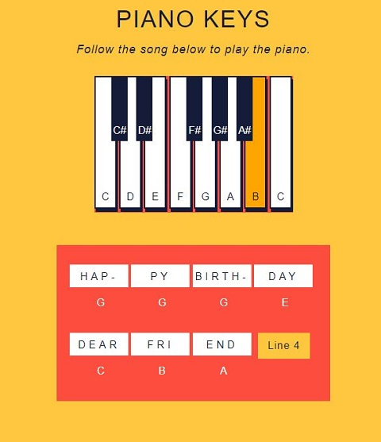

# Piano Keys

This project was completed as part of Codecademy's Building Interactive JavaScript Websites course. As part of the DOM Events with JavaScript tutorial we were required to build an interactive piano player in the Piano Keys project. The index.html and style.css files were already provided, and in script.js we were required to write all of the functions and event handlers to add interactivity as the keys were pressed and to change the song lyrics as the player progressed through the Happy Birthday song.

## Table of Contents

- [Technologies](#technologies)
- [Screenshots](#screenshots)
- [Status](#status)

## Technologies

This project was created with:

- JavaScript ES6
- HTML5
- CSS3

## Screenshots

## Status

This project has been completed.